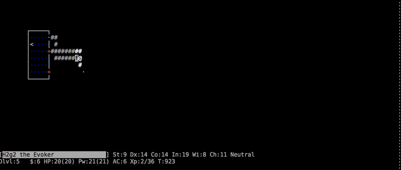

# LazyNethack

*A Screensaver for MacOS which let's you watch live nethack games*

## Installation

### Option 1: Download

Ok, I'll be honest. This is my first MacOS/Swift app and I just built it for my personal nethack viewing pleasure. So things might be broken. However, I also compiled things and bundled them as a release.

1. Download from https://github.com/tessi/LazyNethack/releases
1. Unpack the LazyNethack-x.x.zip file.
1. Double-click (Open) the LazyNethack.saver file and choose to install it.
1. Open up System Preferences > Desktop and Screen Saver > Screen Saver
1. Select "LazyNethack" (It'll be at the bottom of the Screen Savers list.)

### Option 2: Build it yourself

* Clone the repository
* Open in Xcode and build the **LazyNethack** target
* In the "Products" folder, right click on **LazyNethack.saver** and choose *Open with External Editor*
* Follow the instructions on screen

### Gotchas

* It needs internet to connect to alt.org (the place where nethack people play online). If things don't load, chances are you're firewall blocks requests.

## Development and Contribution

Feel free to contribute by adding issues or opening pull requests.

Apart from fixing the known and unknown problems - I'm sure you can teach me a thing or two since this is a first in many ways (my first screensaver, my first swift app, my first thing built with XCode). I'm happy for any issues or pull requests in that regard.

### Architecture

The screensaver consists of two parts:

* A Swift part which hooks into the MacOS screensaver app and opens a WebView . Find the source in `Source`.
* and a webpage which is opened in that WebView. Find it in `App/Ressources/index.html`. It creates a terminal (`hterm`) and opens a websocket connection to a nethack server. `gameControl.js` is responsible to orchestrate that and contains the logic how to join nethack games and when to switch to new games.

## Thanks

* **Alastair Tse** - His screen saver project [WebViewScreensaver](https://github.com/liquidx/webviewscreensaver) helped me a lot with getting a web view to run.
* **Mattias Jahnke** - His screen saver project [WorldClock](https://github.com/mattiasjahnke/WordClock) was my go to source for a nice SWIFT setup for screensavers.
* **alt.org/nethack** - A place where fellow nethack'ians play nethack online for the viewing pleasure of the world. They have their own [page]() where people can watch the game. This page heavily inspired me and my approach to base this screensaver on a WebView component.

## License

[MIT](https://github.com/mattiasjahnke/WordClock/blob/master/LICENSE)
